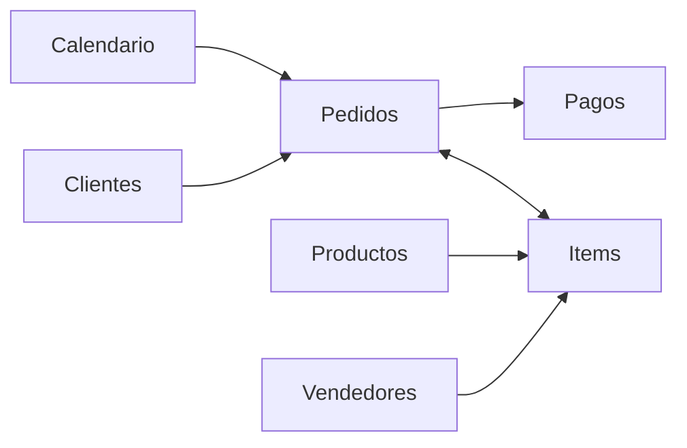

<div align="center">

[English](README.md) · **Español**

# Olist E-commerce · Dashboard ejecutivo

**Un dashboard de Power BI que le dice a la dirección si el negocio va en camino, por qué, y dónde actuar primero.**


[Hallazgos](#hallazgos-clave) · [Páginas](#páginas) · [Modelo de datos](#modelo-de-datos) · [Diseño](#diseño-del-reporte) · [Cómo abrirlo](#cómo-abrirlo)

<br>


<sub>Olist es un marketplace de e-commerce brasileño.</sub>

</div>

## Hallazgos clave

<sub>Enero–agosto 2018 contra el mismo período de 2017.</sub>

<table>
  <tr>
    <td align="center" width="33%"><h2>+146,5%</h2>crecimiento de ventas<br><sub>R$ 8,4 M · 112% de la meta a la fecha</sub></td>
    <td align="center" width="33%"><h2>83%</h2>de la meta anual al cierre del año<br><sub>R$ 12,6 M proyectados vs. R$ 15,2 M</sub></td>
    <td align="center" width="33%"><h2>+4,3 pp</h2>entregas con retraso (hoy 7,8%)<br><sub>el 75% ocurre en el transporte, no en el despacho</sub></td>
  </tr>
  <tr>
    <td align="center"><h2>2,24 vs 4,30</h2>puntaje de reseña, con retraso vs. a tiempo<br><sub>reducir los retrasos a la mitad → 4,14 a 4,22</sub></td>
    <td align="center"><h2>16 de 63</h2>categorías generan el 80% del margen<br><sub>margen de contribución, Pareto/ABC</sub></td>
    <td align="center"><h2>2,1%</h2>de los clientes vuelve a comprar<br><sub>retención mensual por cohorte &lt; 1%</sub></td>
  </tr>
</table>

> [!NOTE]
> Olist no publica sus costos, así que el margen usa **supuestos editables**: costo de mercadería por categoría y una comisión de pago del 3%. La meta supone +120% sobre el año anterior. El reporte indica ambos como supuestos.

## Páginas

<table>
  <tr>
    <td width="50%" valign="top">
      <b>Rentabilidad</b><br>
      <sub>Margen de contribución por categoría, Pareto/ABC y qué tan concentrado está el margen.</sub><br><br>
      
    </td>
    <td width="50%" valign="top">
      <b>Operación</b><br>
      <sub>Por qué llegan tarde los pedidos (despacho del vendedor vs. transportista) y qué vendedores revisar primero.</sub><br><br>
      
    </td>
  </tr>
  <tr>
    <td valign="top">
      <b>Clientes</b><br>
      <sub>Retención por cohorte de primera compra, frecuencia de compra y rangos de ticket.</sub><br><br>
      
    </td>
    <td valign="top">
      <b>Planificación</b><br>
      <sub>Real vs. proyección vs. meta, y escenarios what-if para la meta y los retrasos.</sub><br><br>
      
    </td>
  </tr>
</table>

## Modelo de datos

Un esquema estrella construido en Power Query a partir de un único archivo plano. Reemplaza al modelo original de una sola tabla, que **inflaba las ventas un 28%** porque los pagos se repetían una vez por cada ítem del pedido.



| Capa | Contenido |
|---|---|
| **Hechos** | `Items` (109.796 ítems) y `Pagos` (100.396 pagos), ambos relacionados con `Pedidos` (96.124 pedidos) |
| **Dimensiones** | `Clientes`, `Productos`, `Vendedores` y una tabla `Calendario` marcada como tabla de fechas |
| **Medidas** | Más de 120 medidas DAX organizadas en carpetas: ventas, pedidos, clientes, logística, reseñas, rentabilidad, comparación con el año anterior, metas y proyección, escenarios y visuales SVG dentro de tablas |

Decisiones de diseño:

- **Filtrado:** una única relación bidireccional (`Items` ↔ `Pedidos`), para que los filtros de producto lleguen a los KPIs a nivel de pedido.
- **Comparaciones:** los valores del año anterior se cortan en la última fecha con datos, así enero–agosto nunca se compara contra un año completo.
- **Rendimiento:** una tabla precalculada `Recompras` dibuja la matriz de cohortes en ~0,2 s en lugar de ~8 s.

## Diseño del reporte

- **Paleta:** tema oscuro con una paleta categórica **validada para daltonismo** sobre el fondo oscuro.
- **Gráficos:** sin gráficos de doble eje; las líneas de meta y proyección van punteadas.
- **Variaciones:** siempre con ▲/▼ y una etiqueta, nunca solo con color.
- **Fondos:** diseñados en HTML/CSS y renderizados a PNG. Los visuales nativos se ubican encima con las mismas coordenadas de [`design/layout.json`](design/layout.json).

<details>
<summary><b>Estructura del repositorio</b></summary>

```
Olist_Dashboard.pbip              ← abrir este archivo en Power BI Desktop
Olist_Dashboard.SemanticModel/    ← modelo (TMDL)
Olist_Dashboard.Report/           ← reporte (PBIR)
powerquery/                       ← scripts de Power Query (M) de cada tabla
design/
  layout.json                     ← paleta y geometría de cada página (fuente única de verdad)
  build.py                        ← regenera todo, en orden
  build_model_extras.py           ← medidas DAX generadas por patrón (año anterior, variación, SVG)
  build_backgrounds.py            ← fondos de página en HTML → PNG (Edge headless)
  build_report.py                 ← páginas y visuales PBIR
  validate.py                     ← verifica que cada campo usado por un visual exista en el modelo
docs/img/                         ← capturas usadas en este README
```

</details>

## Cómo abrirlo

1. Descargá el [dataset de Olist en Kaggle](https://www.kaggle.com/datasets/olistbr/brazilian-ecommerce). El modelo lee `df_EDA.csv`, el archivo consolidado que generan los notebooks de este proyecto.
2. Poné el archivo en `data/df_EDA.csv`, o cambiá el parámetro `RutaCSV` en Power Query.
3. Abrí `Olist_Dashboard.pbip` en Power BI Desktop y actualizá.

Para regenerar las medidas extra, los fondos y las páginas después de editar `design/layout.json` (Windows, Python 3.10+, Microsoft Edge, con Power BI Desktop cerrado):

```bash
python design/build.py
```

---

<div align="center"><sub>Hecho por <a href="https://github.com/CordobaGabriel">Gabriel Cordoba</a> · <a href="https://www.linkedin.com/in/cordobagabriel">LinkedIn</a></sub></div>
