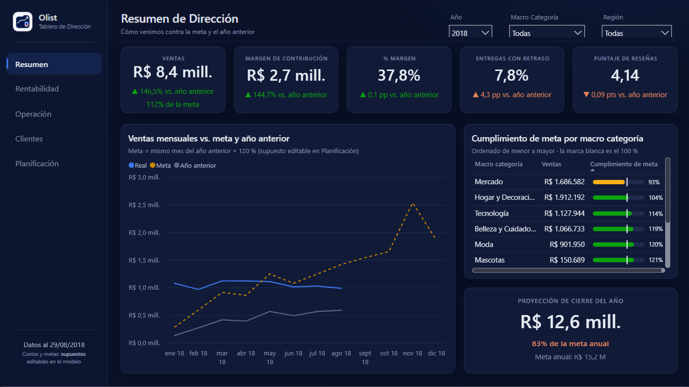
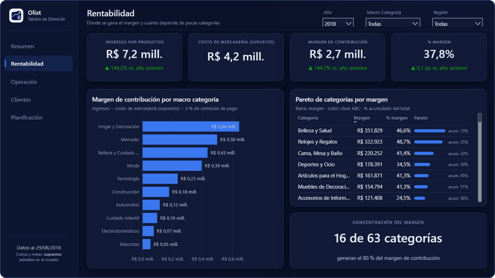
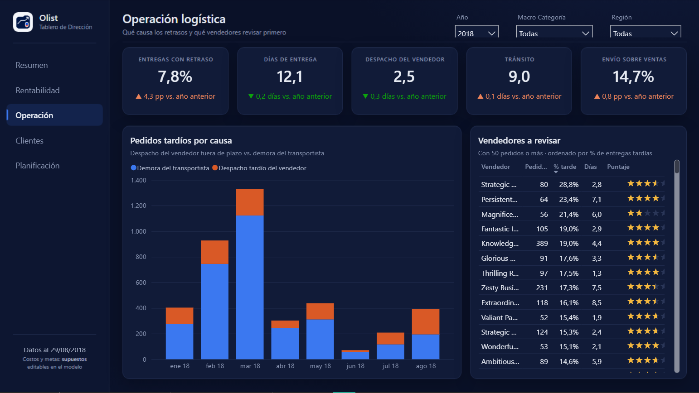
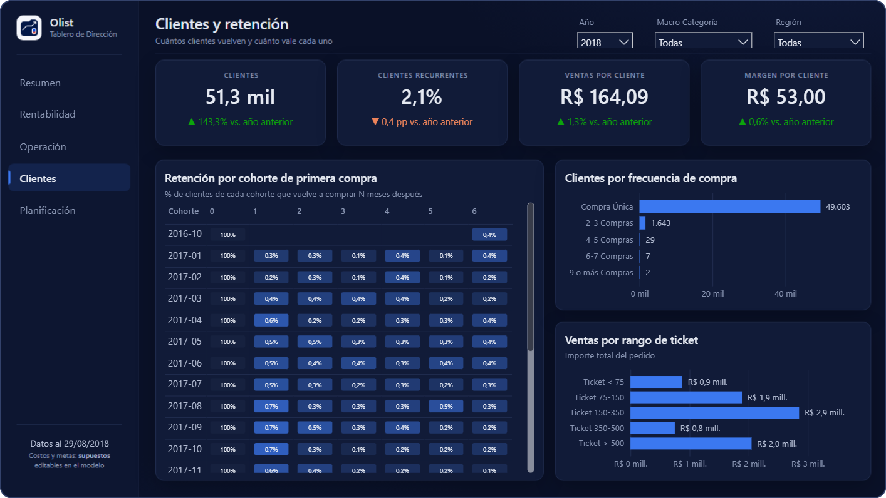
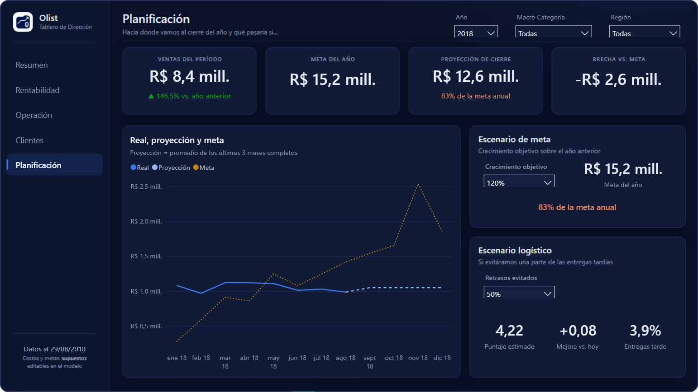
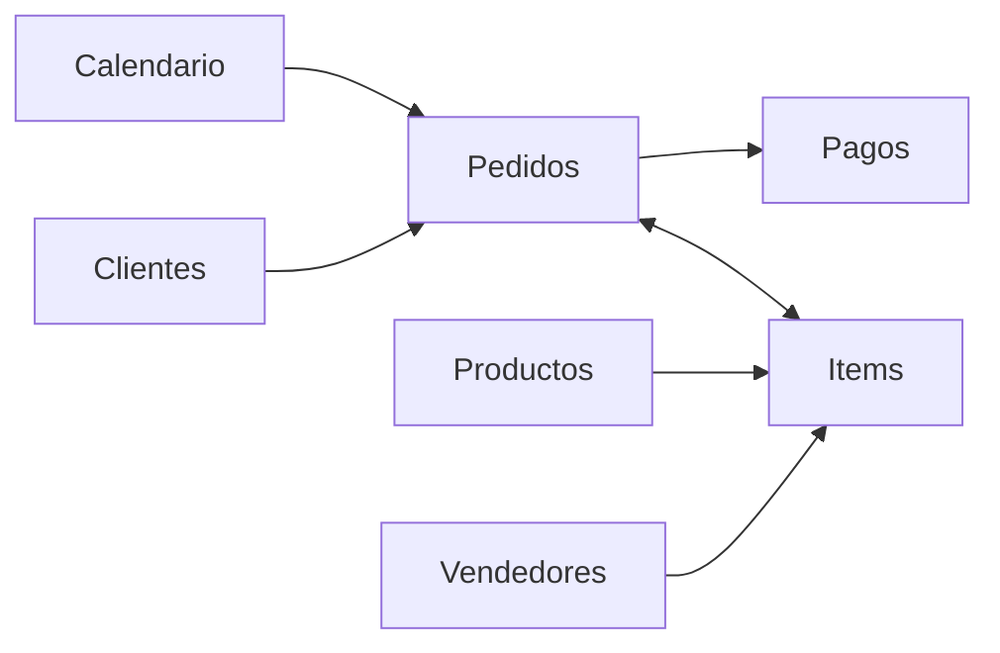

<div align="center">

# Olist E-commerce · Executive Dashboard

**A Power BI dashboard that tells leadership whether the business is on track, why, and where to act first.**


[Key findings](#key-findings) · [Pages](#pages) · [Data model](#data-model) · [Design](#report-design) · [How to open](#how-to-open-it)

<br>



<sub>Olist is a Brazilian e-commerce marketplace. The dashboard is in Spanish.</sub>

</div>

## Key findings

<sub>January–August 2018 vs. the same period of 2017.</sub>

<table>
  <tr>
    <td align="center" width="33%"><h2>+146.5%</h2>sales growth<br><sub>R$ 8.4M · 112% of the target so far</sub></td>
    <td align="center" width="33%"><h2>83%</h2>of the annual target at year-end<br><sub>R$ 12.6M projected vs. R$ 15.2M</sub></td>
    <td align="center" width="33%"><h2>+4.3 pp</h2>late deliveries (now 7.8%)<br><sub>75% happen in transit, not dispatch</sub></td>
  </tr>
  <tr>
    <td align="center"><h2>2.24 vs 4.30</h2>review score, late vs. on time<br><sub>halving delays → 4.14 to 4.22</sub></td>
    <td align="center"><h2>16 of 63</h2>categories make 80% of margin<br><sub>contribution margin, Pareto/ABC</sub></td>
    <td align="center"><h2>2.1%</h2>of customers buy again<br><sub>monthly cohort retention &lt; 1%</sub></td>
  </tr>
</table>

> [!NOTE]
> Olist does not publish costs, so margin uses **editable assumptions**: cost of goods by category and a 3% payment fee. The target assumes +120% over the previous year. The report flags both as assumptions.

## Pages

<table>
  <tr>
    <td width="50%" valign="top">
      <b>Rentabilidad</b> · profitability<br>
      <sub>Contribution margin by category, Pareto/ABC and how concentrated the margin is.</sub><br><br>
      
    </td>
    <td width="50%" valign="top">
      <b>Operación</b> · logistics<br>
      <sub>Why deliveries are late (seller dispatch vs. carrier) and which sellers to review first.</sub><br><br>
      
    </td>
  </tr>
  <tr>
    <td valign="top">
      <b>Clientes</b> · customers<br>
      <sub>Retention by first-purchase cohort, purchase frequency and ticket ranges.</sub><br><br>
      
    </td>
    <td valign="top">
      <b>Planificación</b> · planning<br>
      <sub>Actual vs. projection vs. target, plus what-if scenarios for the target and for delays.</sub><br><br>
      
    </td>
  </tr>
</table>

## Data model

A star schema built in Power Query from a single flat file. It replaces the original one-table model, which **inflated sales by 28%** because payments were repeated once per order item.



| Layer | Contents |
|---|---|
| **Facts** | `Items` (109,796 order items) and `Pagos` (100,396 payments), both related to `Pedidos` (96,124 orders) |
| **Dimensions** | `Clientes`, `Productos`, `Vendedores` and a marked `Calendario` date table |
| **Measures** | 120+ DAX measures in folders: sales, orders, customers, logistics, reviews, profitability, prior-year comparisons, targets and projection, scenarios, and SVG visuals rendered inside tables |

Design choices:

- **Filtering:** a single bidirectional relationship (`Items` ↔ `Pedidos`), so product filters reach order-level KPIs.
- **Comparisons:** prior-year values are capped at the last date with data, so January–August is never compared against a full year.
- **Performance:** a precomputed `Recompras` table renders the cohort matrix in ~0.2 s instead of ~8 s.

## Report design

- **Palette:** a dark theme whose categorical palette is **validated for color-vision deficiency** on the dark surface.
- **Charts:** no dual-axis charts; target and projection lines are dashed.
- **Variance:** always shown with ▲/▼ and a label, never with color alone.
- **Backgrounds:** designed in HTML/CSS and rendered to PNG. The native visuals are placed on top using the same coordinates from [`design/layout.json`](design/layout.json).

<details>
<summary><b>Repository structure</b></summary>

```
Olist_Dashboard.pbip              ← open this in Power BI Desktop
Olist_Dashboard.SemanticModel/    ← model (TMDL)
Olist_Dashboard.Report/           ← report (PBIR)
powerquery/                       ← Power Query (M) scripts for each table
design/
  layout.json                     ← palette and geometry of every page (single source of truth)
  build.py                        ← regenerates everything, in order
  build_model_extras.py           ← pattern-based DAX measures (prior year, variance, SVG)
  build_backgrounds.py            ← HTML page backgrounds → PNG (headless Edge)
  build_report.py                 ← PBIR pages and visuals
  validate.py                     ← checks that every field used by a visual exists in the model
docs/img/                         ← screenshots used in this README
```

</details>

## How to open it

1. Download the [Olist dataset from Kaggle](https://www.kaggle.com/datasets/olistbr/brazilian-ecommerce). The model reads `df_EDA.csv`, the consolidated file produced by the EDA notebooks of this project.
2. Put the file in `data/df_EDA.csv`, or change the `RutaCSV` parameter in Power Query.
3. Open `Olist_Dashboard.pbip` in Power BI Desktop and refresh.

To regenerate the model extras, backgrounds and pages after editing `design/layout.json` (Windows, Python 3.10+, Microsoft Edge, with Power BI Desktop closed):

```bash
python design/build.py
```

---

<div align="center"><sub>Built by <a href="https://github.com/CordobaGabriel">Gabriel Cordoba</a> · <a href="https://www.linkedin.com/in/cordobagabriel">LinkedIn</a></sub></div>
